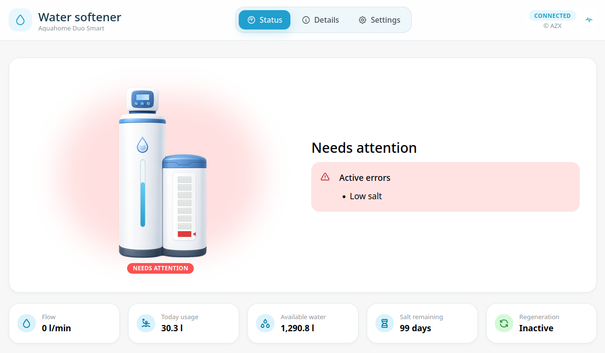
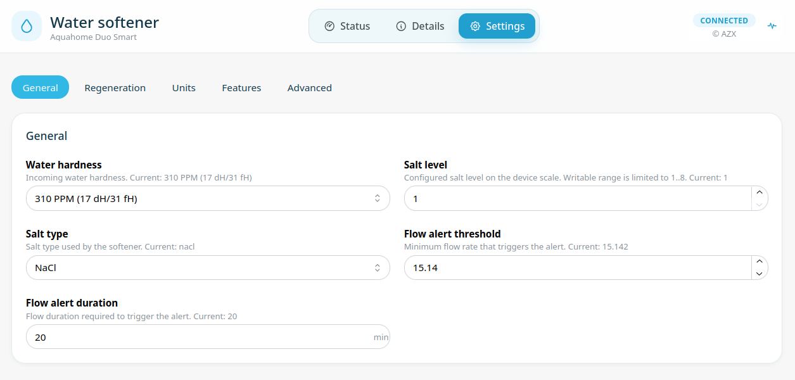
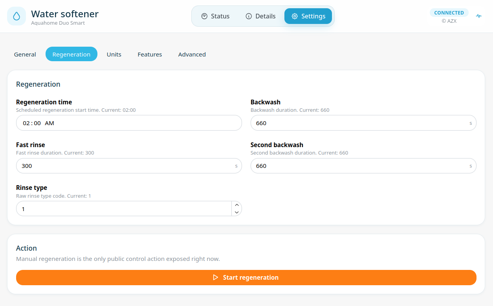

# Softener Gateway

Softener Gateway is intended primarily as a Home Assistant add-on for
EcoWater/iQua-family water softeners and branded devices built on the same platform,
including Viessmann, EcoWater, North Star, Morton, Whirlpool, Rheem, GE and Kenmore
devices.

It can also run as a standalone Docker container with the same local HTTP UI and
optional MQTT publishing.

It converts a compatible softener from a cloud-based device into one that can be
controlled fully locally. It also exposes more device information and configuration
options than the iQua app. The gateway can run fully locally, or in bridge mode that
forwards traffic while exposing the device state through a local HTTP API and MQTT
with Home Assistant discovery.

## Screenshots









## What It Does

- Provides a local TLS MQTT endpoint for the softener.
- Exposes a Home Assistant ingress UI for status, settings and diagnostics.
- Provides a fully documented OpenAPI HTTP API with Swagger UI available at
  `/docs` for custom integrations and automation.
- Publishes Home Assistant MQTT discovery entities when MQTT is enabled.
- Supports metric and imperial unit systems.
- Can record bridge session logs when troubleshooting is enabled.
- Includes a companion certificate flashing tool for preparing a device for local use.

## Modes

### Local Mode

Local mode is the default mode. The softener connects to the add-on, and the add-on
responds locally. This is the preferred mode for daily use when your device works
with the local protocol flow. In this mode, available device data is refreshed
continuously, including flow and other runtime values.

### Bridge Mode

Bridge mode connects the softener to the add-on and forwards the device traffic to
the original AWS IoT endpoint. Use it when you still need the cloud path, or when
collecting diagnostic data before switching to fully local operation.

Bridge mode requires the original device certificate and private key.
Available data appears only when it is exchanged between the softener and the cloud,
which normally happens rarely and when the iQua app is being used.

## Installation

1. In Home Assistant, open **Settings** -> **Add-ons** -> **Add-on Store**.
2. Open the three-dot menu and choose **Repositories**.
3. Add this repository URL:

   ```text
   https://github.com/arturzx/softener-gateway
   ```

4. Install **Softener Gateway**.
5. Paste the generated endpoint certificate and private key into the add-on options.
6. Start the add-on and open **Softener Gateway** from the Home Assistant sidebar.

## Add-on Configuration

The most important options are:

- `mode`: `local` or `bridge`; default is `local`.
- `unit_system`: `metric` or `imperial`; default is `metric`.
- `endpoint.certificate`: PEM certificate served to the softener; use the generated
  `softener-gateway.crt` file by default.
- `endpoint.key`: PEM private key for the endpoint certificate; use the generated
  `softener-gateway.key` file by default.
- `endpoint.port`: TLS MQTT listener port inside the add-on; default is `8883`.
- `aws.host`, `aws.certificate`, `aws.key`: required only for bridge mode; these
  values must come from the original `aws_certs` partition read by the flasher.
- `session_log`: saves bridge session logs to the Home Assistant shared folder.
- `mqtt.enabled`: enables MQTT publishing and Home Assistant discovery.

HTTP ingress is always enabled and served on port `8080` inside the container.
For the Home Assistant add-on store view, see `softener-gateway/README.md`; for
full add-on documentation, see `softener-gateway/DOCS.md`.

## Certificate Flashing Tool

The repository includes `tools/softener-certs-flasher`, a helper tool that prepares
the softener certificate partition and generates the local gateway certificate.
It replaces the endpoint host stored in the softener's `aws_certs` partition so the
softener connects to the Home Assistant add-on instead of the original cloud host.
Use the Home Assistant host DNS name, or the machine's IPv4 address when avoiding
local DNS issues. Keep the endpoint port at the default `8883` unless the add-on is
configured to listen on a different port, and avoid `.local` names because tested
devices did not resolve mDNS names.

The flasher is designed to be conservative and safe. It creates backups, verifies
readbacks, validates rebuilt payloads and refuses to continue when it cannot keep the
process controlled. Bricking the device is highly unlikely, but the final risk remains
with the user. The author is not responsible for damage, data loss or device downtime.

The tool stores the device MAC address in its manifest and refuses recovery flashing
when the connected device does not match the backup.

## Safety Notes

- Keep private keys, flash dumps, packet captures and session logs private.
- Do not publish files generated by the flasher.
- Recovery backups are device-specific.
- Bridge logs may contain device identifiers and cloud payloads.

## Project Layout

```text
repository.yaml              Home Assistant add-on repository metadata
softener-gateway/            Home Assistant add-on
tools/softener-certs-flasher/ Certificate and flash helper
```

## License

The main Softener Gateway add-on source is source-available for non-commercial use
under the PolyForm Noncommercial License 1.0.0.

The certificate flashing tool is licensed separately because it depends on Espressif
`esptool`, which is GPL-licensed. See the license files for details.

## Not Affiliated

This project is not affiliated with, endorsed by or sponsored by EcoWater,
Viessmann, North Star, Morton, Whirlpool, Rheem, GE, Kenmore, Amazon Web Services,
Home Assistant or Nabu Casa.
