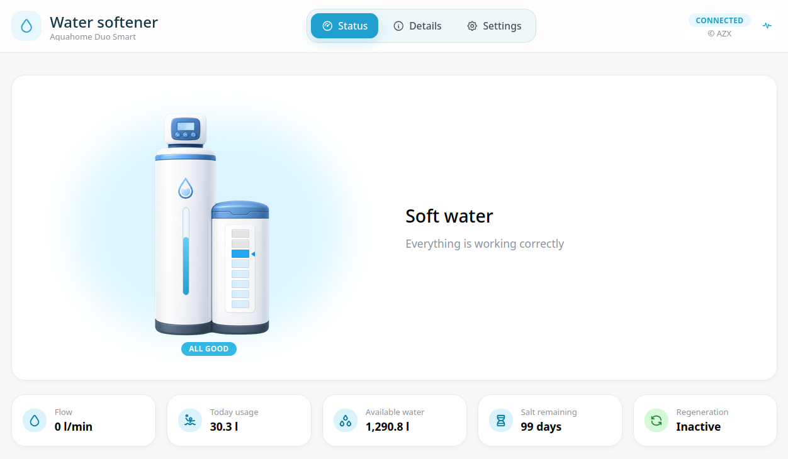
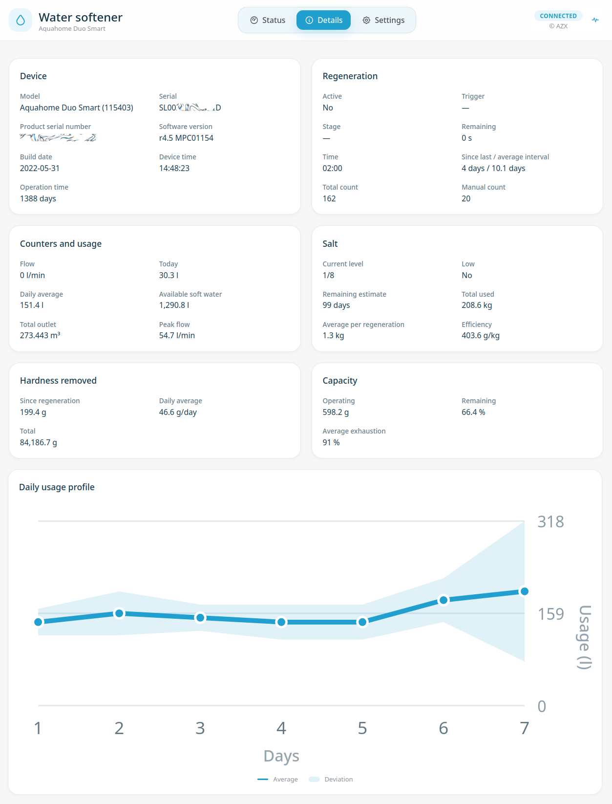

# Softener Gateway

Convert compatible EcoWater/iQua-family water softeners from cloud-based devices
into locally controlled devices.

Softener Gateway is intended primarily as a Home Assistant add-on. It provides a
local TLS MQTT endpoint for the softener, a Home Assistant ingress UI, a documented
HTTP API and optional MQTT publishing with Home Assistant discovery.

It can run in two modes:

- **Local mode**: the softener talks to the add-on and the add-on responds locally.
- **Bridge mode**: the add-on forwards traffic to the original cloud endpoint while
  exposing device state locally.

## Preview

The companion certificate flashing tool prepares the device by replacing the cloud
endpoint in the softener certificate partition with the local gateway endpoint.

For setup steps, configuration options and safety notes, open the add-on
documentation.
