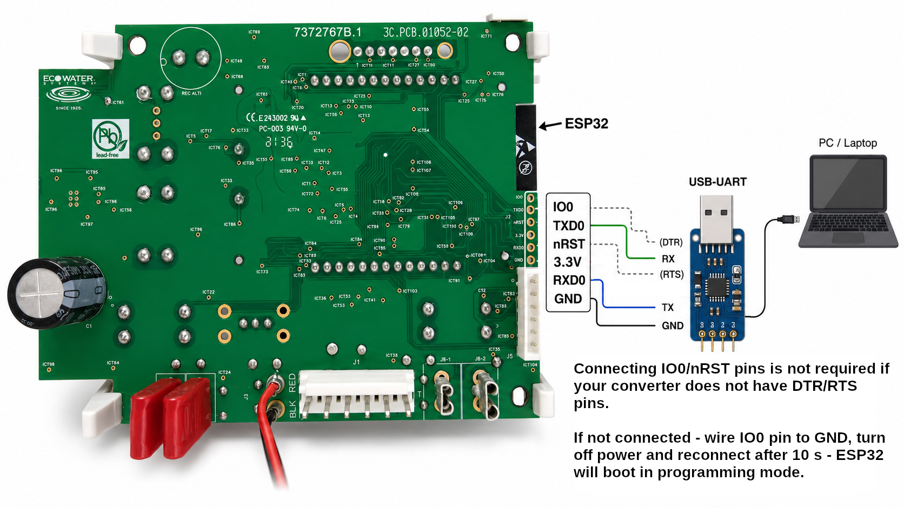

# softener-certs-flasher

A guided tool for safely patching the `aws_certs` partition on a compatible
softener device.

Compatible devices contain an ESP32, which is generally a recoverable and reasonably
safe platform to flash when the original flash contents are backed up. The flasher
does what it can to keep the process consistent: it reads the flash twice, verifies
that both reads match, validates the parsed `aws_certs` payload, writes only the
target partition and verifies the written data with a readback. The final risk still
belongs to the user.

Flashing requires a 3.3 V UART interface. Do not use a 5 V UART adapter. At minimum,
connect RX, TX and GND. A UART adapter with BOOT and RST control is preferred; if
BOOT is not available, connect the ESP32 IO0 pin to GND while flashing. The module
must be powered from its normal mains power supply during flashing. There is no need
to solder pin headers; regular breadboard jumper wires inserted into the header
holes are enough for flashing.



## What It Does

1. Reads the device MAC address through the `esptool` package API, equivalent to
   `esptool read-mac`.
2. Reads the full flash twice through the `esptool` package API, equivalent to
   `esptool read-flash`.
3. Requires both flash reads to be byte-for-byte identical.
4. Parses the ESP partition table and locates the `aws_certs` partition.
5. Parses `aws_certs` as a newline-delimited payload; if it cannot do that safely,
   it stops with a STOP message.
6. Generates a local CA and server certificate, or uses the CA provided with
   `--ca-cert`.
7. Builds a new `aws_certs_patched.bin` image.
8. Verifies the patched image with the parser and checks boundary conditions.
9. Writes a manifest with the MAC address, fingerprints, hashes and equivalent
   hyphenated `esptool` commands.
10. After confirmation, writes only the `aws_certs` partition.
11. Reads the partition back and compares it byte-for-byte with
    `aws_certs_patched.bin`.

## Example

Create a virtual environment, install the flasher and run it against a known serial
port:

```bash
cd tools/softener-certs-flasher
python -m venv venv
. venv/bin/activate
python -m pip install --upgrade pip
python -m pip install -e .
softener-certs-flasher \
  --port /dev/ttyUSB0
```

The flasher will ask interactively for values that are not provided on the command
line. By default, it also asks before writing to the device. Answer `n` to prepare
artifacts and a manifest without flashing.

## Endpoint Host and Port

When the flasher asks for `Replacement endpoint host`, enter the domain name of the
Home Assistant host that runs the add-on. Use a regular DNS name with at least one
dot, for example `homeassistant.lan`.

Do not use a `.local` domain such as `homeassistant.local`. The tested devices did
not have an mDNS resolver, so names that work from a laptop or phone may still fail
from the softener.

Keep `Replacement endpoint port` at the default `8883` unless the add-on is
configured to listen on a different port.

You can also enter the Home Assistant machine's IPv4 address directly, for example
`192.168.1.50`. This is recommended when the device has connection problems because
it removes local DNS resolution from the connection path.

Example output from a successful interactive run:

```text
Connecting.....
Detecting chip type... ESP32
Stub flasher running.
Changing baud rate to 460800...
Changed.
Reading device MAC...
Device MAC: xx:xx:xx:xx:xx:xx
Reading full flash, pass 1...
Configuring flash size...
Read 4194304 bytes from 0x00000000 in 100.0 seconds (335.4 kbit/s) to 'softener-certs-flasher-output/flash-read-1.bin'.
Reading full flash, pass 2...
Configuring flash size...
Read 4194304 bytes from 0x00000000 in 99.5 seconds (337.1 kbit/s) to 'softener-certs-flasher-output/flash-read-2.bin'.
Double flash read verified: sha256=<flash-backup-sha256>
Found aws_certs partition: offset=0xa000, size=4864 bytes
Parsed aws_certs payload format: newline_delimited_payload
- host: <aws-endpoint>.iot.us-east-1.amazonaws.com
- port: 8883
- current root CA:
  serial: 0x<amazon-root-ca-serial>
  issuer: CN=Amazon Root CA 1,O=Amazon,C=US
  subject: CN=Amazon Root CA 1,O=Amazon,C=US
  validity: 2015-05-26T00:00:00Z to 2038-01-17T00:00:00Z
- device certificate:
  serial: 0x<device-certificate-serial>
  issuer: OU=Amazon Web Services O=Amazon.com Inc. L=Seattle ST=Washington C=US
  subject: CN=AWS IoT Certificate
  validity: 2022-05-26T09:20:41Z to 2049-12-31T23:59:59Z
- device private key: present; matches device certificate
  public key: RSA 2048 bit
- current payload size: 4197 bytes
- partition size: 4864 bytes
- free bytes: 667 bytes
Replacement endpoint host [<aws-endpoint>.iot.us-east-1.amazonaws.com]: softener-gateway.home.arpa
Replacement endpoint port [8883]: 8883
Generated local CA:
- local root CA:
  serial: 0x<local-root-ca-serial>
  issuer: CN=Softener Local Root CA
  subject: CN=Softener Local Root CA
  validity: 2026-07-08T05:52:53Z to 2036-07-05T05:57:53Z
Generated server certificate:
- server certificate:
  serial: 0x<server-certificate-serial>
  issuer: CN=Softener Local Root CA
  subject: CN=softener-gateway.home.arpa
  validity: 2026-07-08T05:52:53Z to 2036-07-05T05:57:53Z
aws_certs payload format: newline_delimited_payload
planned aws_certs write:
- host: <aws-endpoint>.iot.us-east-1.amazonaws.com -> softener-gateway.home.arpa
- port: 8883 -> 8883
- new root CA:
  serial: 0x<local-root-ca-serial>
  issuer: CN=Softener Local Root CA
  subject: CN=Softener Local Root CA
  validity: 2026-07-08T05:52:53Z to 2036-07-05T05:57:53Z
- device certificate: unchanged; left intact
- device private key: unchanged; left intact
- final payload size: 4063 bytes
- free bytes left in aws_certs partition: 801 bytes
- padding: 0xff
Flash patched aws_certs to the device? [y/N] y
Write patched aws_certs to device now? [y/N] y
Writing patched aws_certs partition...
Configuring flash size...
Flash will be erased from 0x0000a000 to 0x0000bfff...
Wrote 4864 bytes (2987 compressed) at 0x0000a000 in 0.1 seconds (325.4 kbit/s).
Hash of data verified.
Reading aws_certs back for verification...
Configuring flash size...
Read 4864 bytes from 0x0000a000 in 0.1 seconds (334.5 kbit/s) to 'softener-certs-flasher-output/aws_certs_after_flash.bin'.
Flash verified. Manifest: softener-certs-flasher-output/manifest.json
Hard resetting via RTS pin...
```

Recover the original `aws_certs` partition from a backup:

```bash
softener-certs-flasher recover out-softener/manifest.json \
  --yes
```

`--port` is optional. If omitted, `esptool` will try to auto-detect the serial port.
Use `--port-filter` to restrict auto-detection, for example `vid=0x10c4`,
`pid=0xea60`, `name=USB` or `serial=ABC`.

Recovery reads the current device MAC address and compares it with `device.mac` from
the manifest. If the manifest has no MAC address, or if the connected device MAC does
not match, the tool stops with a STOP message before writing flash.

The tool keeps one `esptool` session for the whole run: MAC read, both flash reads,
optional write and verification are performed without disconnecting or resetting
between operations. Reset is performed only when the session is closed.

## Artifacts

The `--output-dir` contains files such as:

- `flash-read-1.bin`: first full flash backup read from the ESP32.
- `flash-read-2.bin`: second full flash backup; it must match `flash-read-1.bin`.
- `aws_certs_original.bin`: original `aws_certs` partition extracted from the flash
  backup.
- `aws_certs_patched.bin`: rebuilt `aws_certs` partition that points the device to
  the local gateway.
- `softener-local-ca.crt`: local root CA certificate written into the rebuilt
  `aws_certs` payload.
- `softener-local-ca.key`: private key for the local root CA; keep it private.
- `softener-gateway.crt`: gateway TLS certificate to paste into the Home Assistant
  add-on `endpoint.certificate` option.
- `softener-gateway.key`: gateway TLS private key to paste into the Home Assistant
  add-on `endpoint.key` option; keep it private.
- `manifest.json`: run manifest with device MAC, hashes, certificate metadata,
  recovery data and equivalent `esptool` commands.

Private keys are written with `0600` permissions.

## aws_certs Safety Rules

- The CA may have a different length than the original as long as the rebuilt payload
  still fits inside the original `aws_certs` partition size.
- If the parser cannot extract all required fields and rebuild the partition in the
  same logical format, the tool stops with a STOP message.
- The new image is padded with `0xff`.
- The device certificate and private key are preserved byte-for-byte unless a future
  version adds explicit options for replacing them.

## License

This tool is licensed separately as GPL-2.0-or-later because it uses the `esptool`
package.
